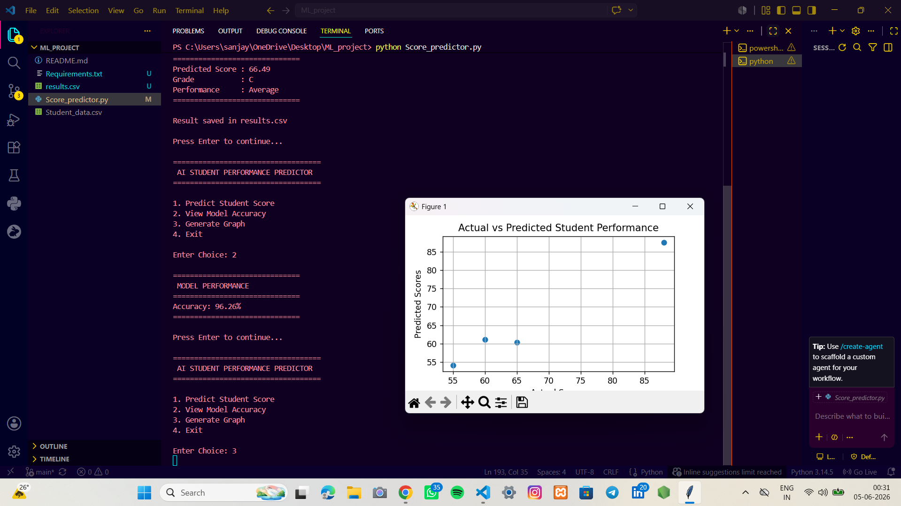

# AI-Powered Student Performance Predictor

Machine Learning project that predicts student performance using:

- Study Hours
- Attendance
- Assignment Scores
- Previous Exam Scores

## Technologies

- Python
- Pandas
- Scikit-Learn
- Matplotlib

## Features

- Score Prediction
- Grade Prediction
- Performance Analysis
- Accuracy Evaluation
- Graph Visualization
- CSV Result Export

## Machine Learning Algorithm

Linear Regression
## Project Output

